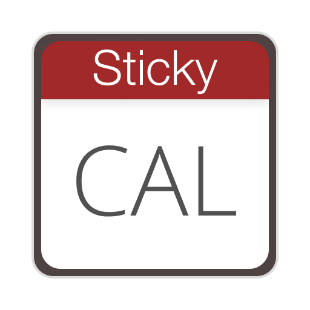
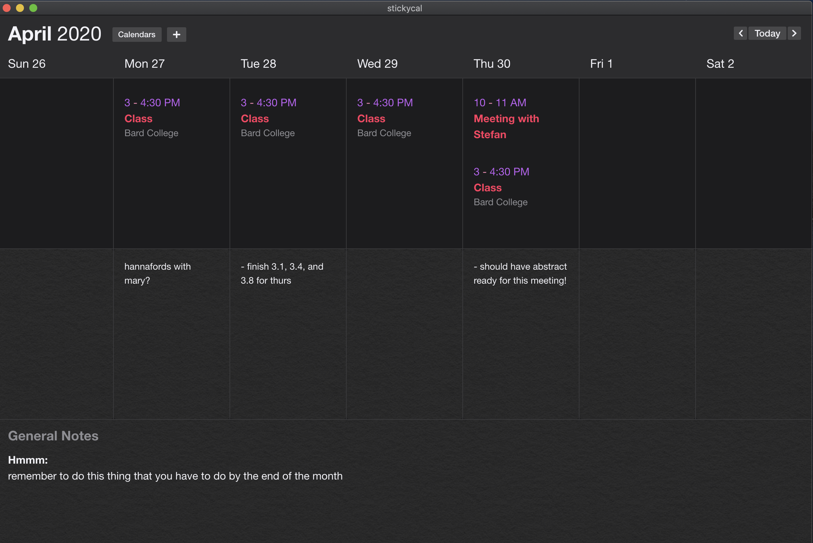

# stickycal

This is a little week-view calendar/notes app!

## Features

- upload calendars by file or url (must be ics)
  - list events in order of occurance
    - shows start & end time, title, location
- toggle active calendars
- notes sections per day
- general notes section


## Possible additions

- integrate with maps?
- list next event
- perhaps add events? not sure if we can
- full event view

## Bugs to fix

- issue with uploading calendars (something funky with the notes sections)
- should do a try-catch for calendar not existing

## Build

Clone repo, run:
```sh
yarn install
yarn electron:build
```

## Screenshot

